# SBTI2 이미지 시안 비교

대상은 11, 12, 16, 17, 18, 19페이지와 루프 엔지니어링입니다. 각 행은 왼쪽부터 픽셀크루, 유령, 개념형 시안입니다. 기존 `sbti2/index.html`과 기존 이미지는 수정하지 않았습니다.

[원본·투명 PNG HTML 갤러리 열기](index.html) · [전체 비교 이미지 열기](comparison-contact-sheet-v2.png)

HTML 갤러리에서는 주제·스타일 필터, 원본/투명 비교, 전체화면 보기와 개별 PNG 다운로드를 사용할 수 있습니다. 투명본 21개는 `transparent/`, 빠른 미리보기용 썸네일은 `thumbs/`에 있습니다.

| 페이지 | 픽셀크루 스타일 | 유령 스타일 | 개념형 스타일 |
|---|---|---|---|
| 11 · 도구 호출의 순환 | [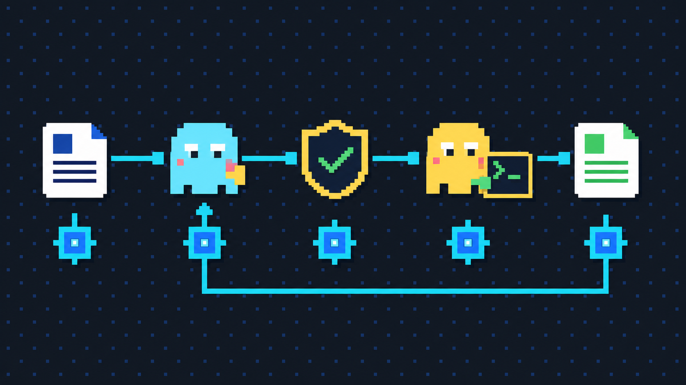](11-tool-calling-pixelcrew.png) | [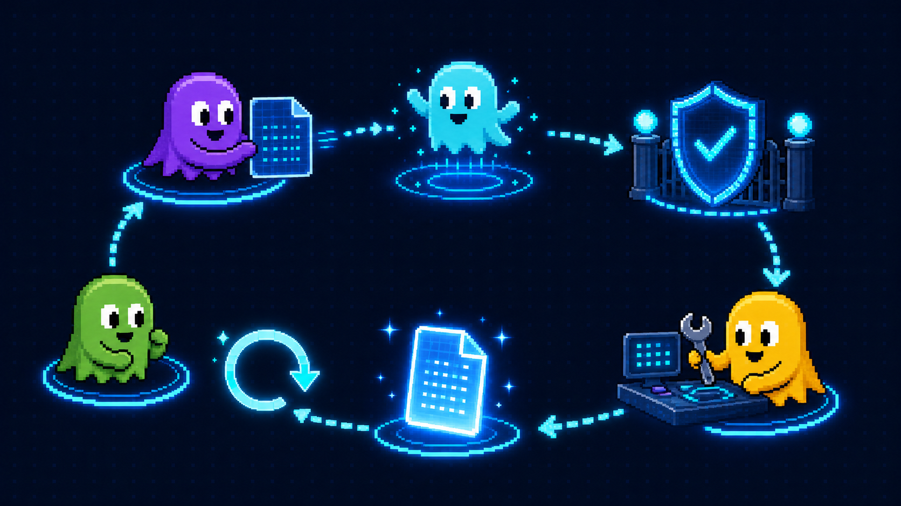](11-tool-calling-ghost.png) | [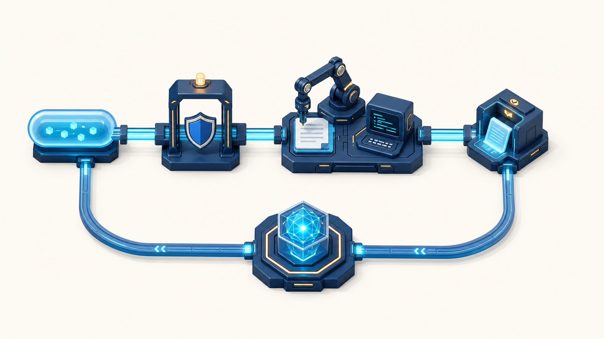](11-tool-calling-concept.png) |
| 12 · 모델과 하네스 역할 분리 |  |  | [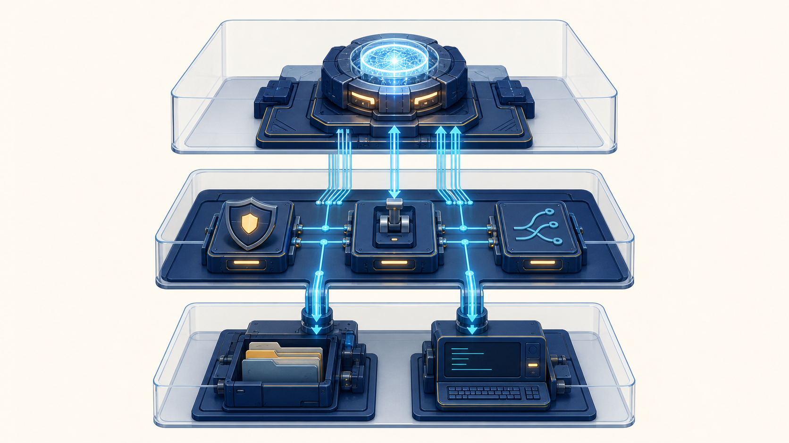](12-model-harness-concept.png) |
| 16 · 싱글과 MAS 선택 | [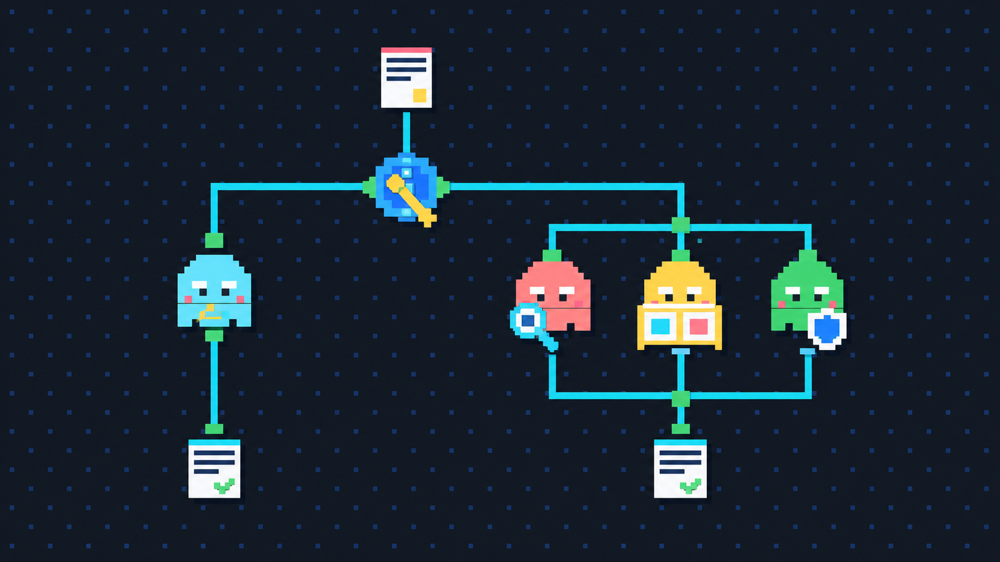](16-single-vs-mas-pixelcrew.png) | [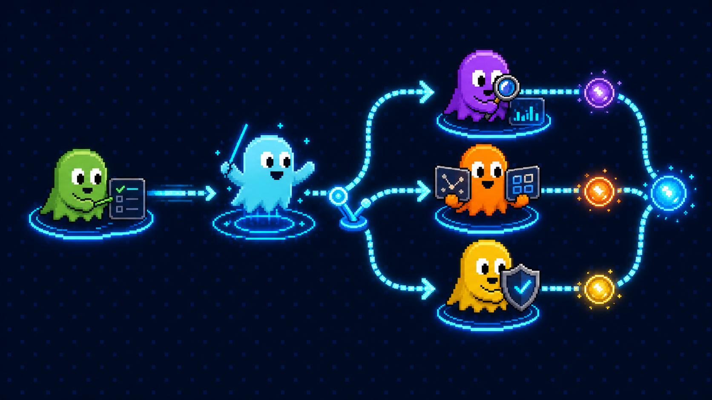](16-single-vs-mas-ghost.png) | [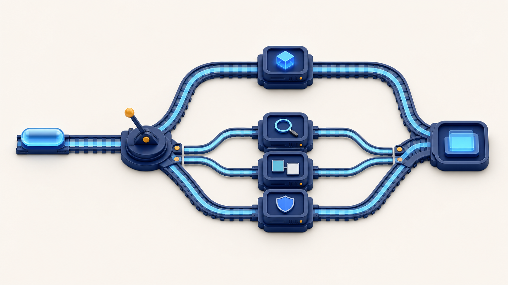](16-single-vs-mas-concept.png) |
| 17 · 오케스트레이터 중심 분업 | [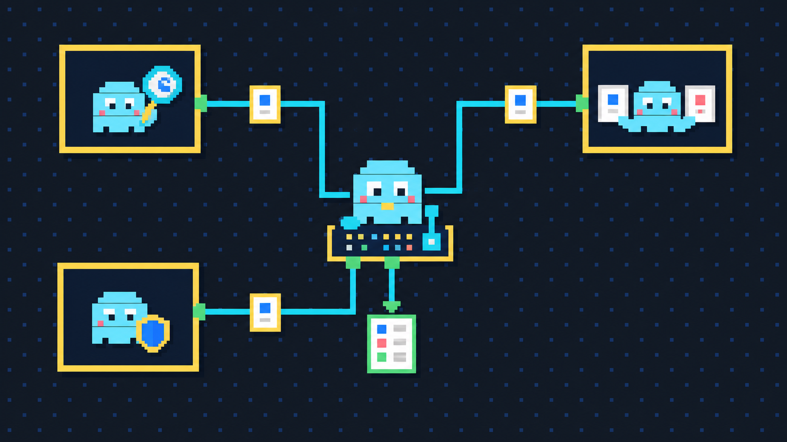](17-orchestrator-mas-pixelcrew.png) | [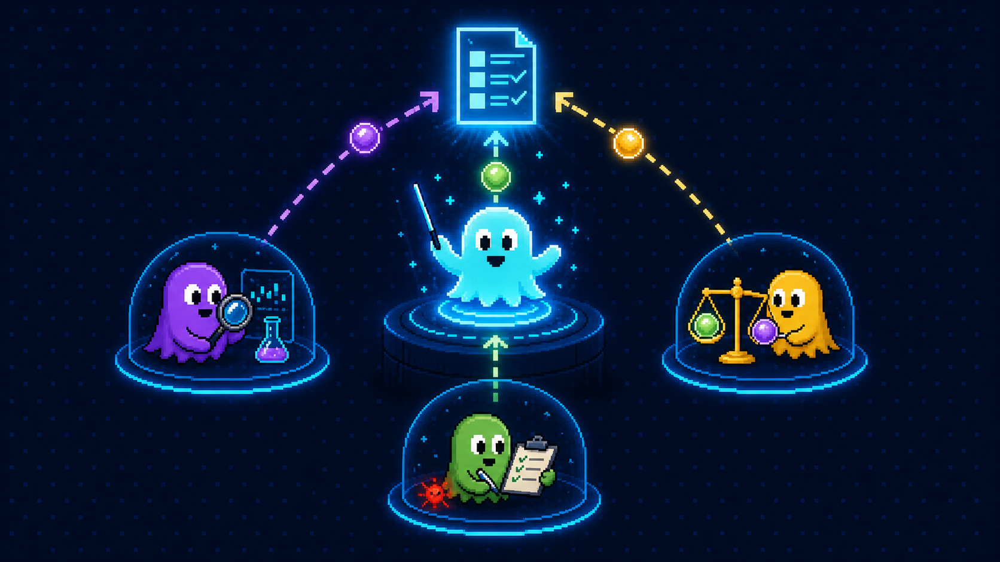](17-orchestrator-mas-ghost.png) | [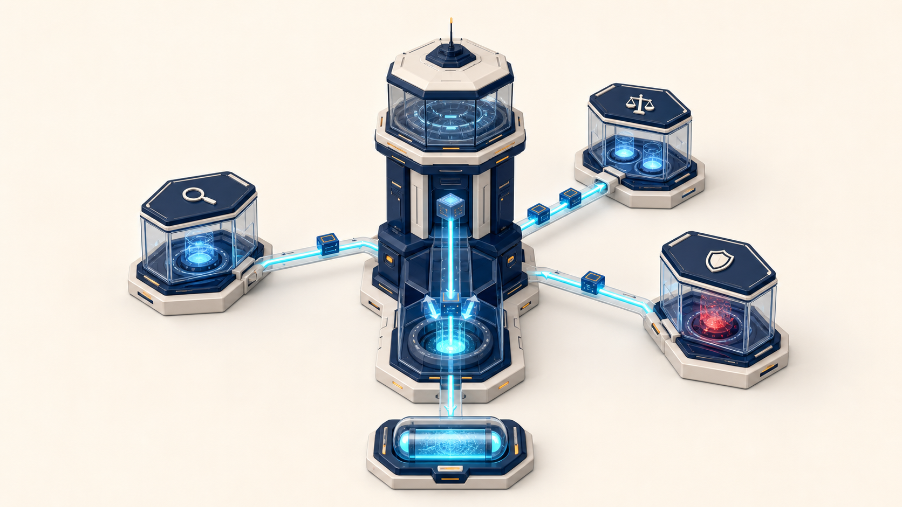](17-orchestrator-mas-concept.png) |
| 18 · 하네스가 감싸는 작업환경 | [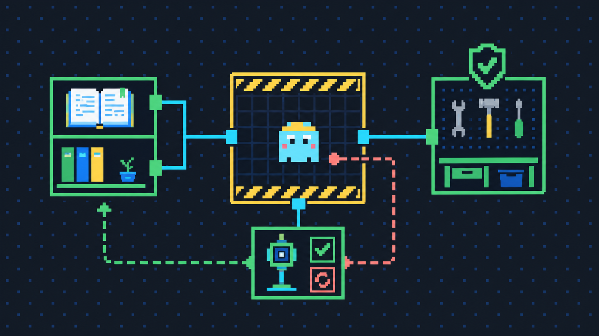](18-harness-environment-pixelcrew.png) | [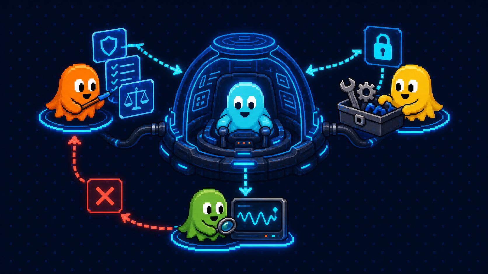](18-harness-environment-ghost.png) | [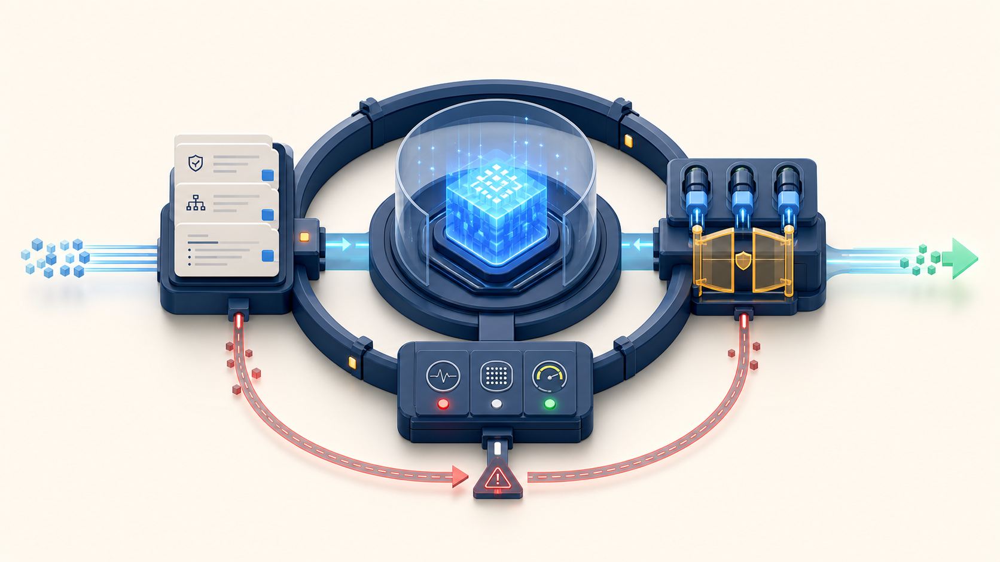](18-harness-environment-concept.png) |
| 19 · 프롬프트·컨텍스트·실행 통제층 | [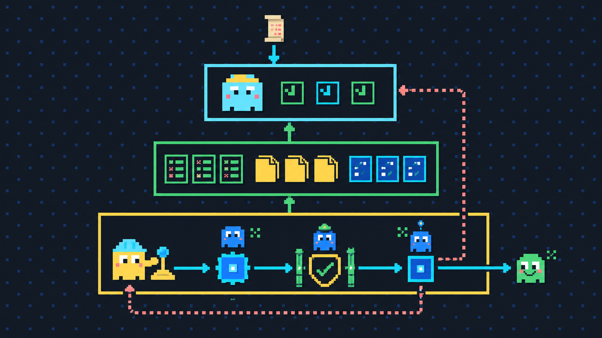](19-harness-layers-pixelcrew.png) | [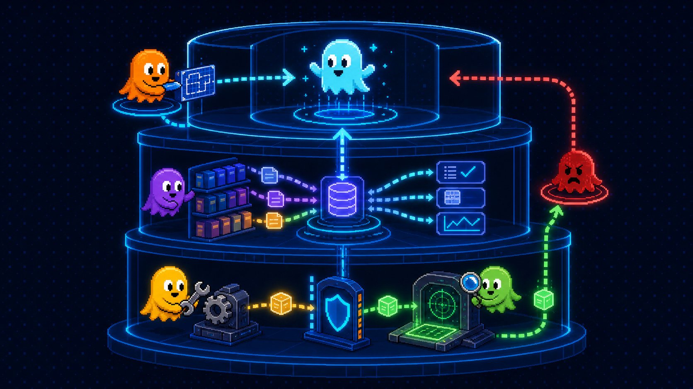](19-harness-layers-ghost.png) |  |
| L · 루프 엔지니어링 | [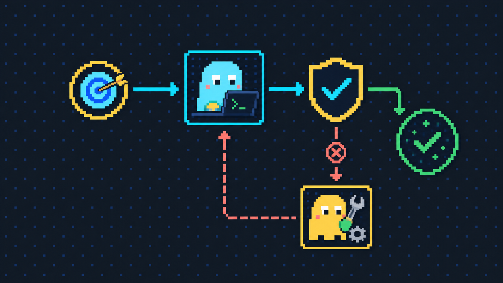](loop-engineering-pixelcrew.png) | [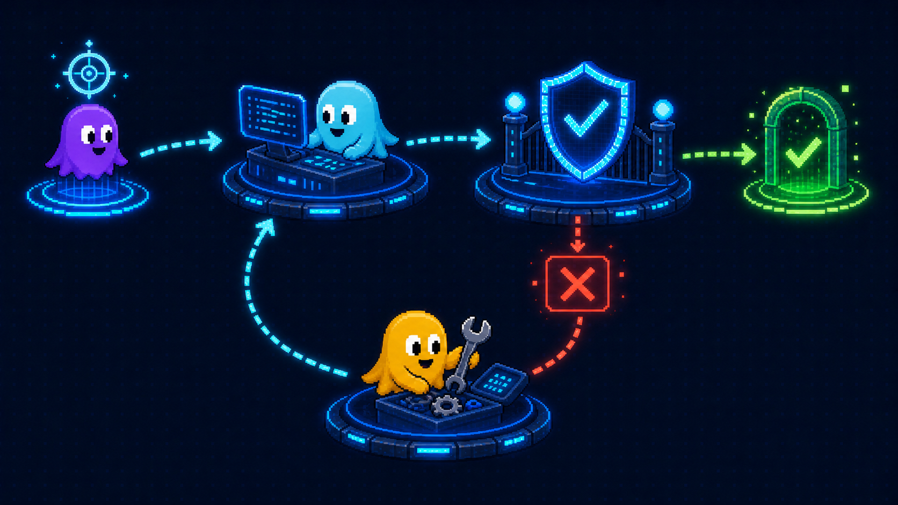](loop-engineering-ghost.png) | [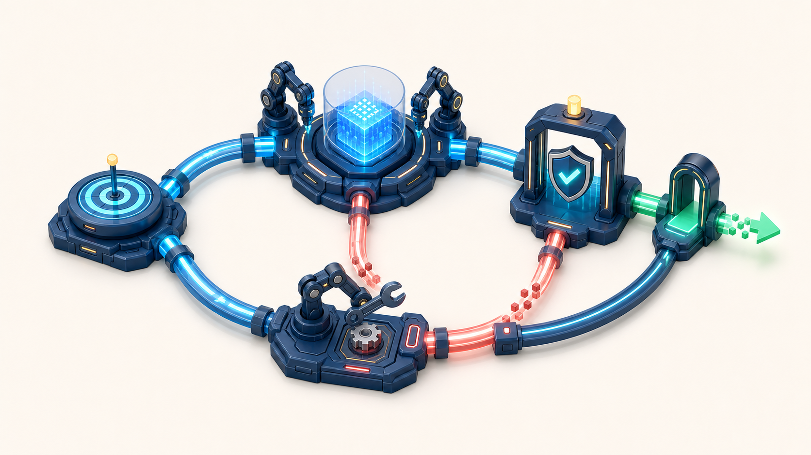](loop-engineering-concept.png) |

## 시각적 구분

- 11페이지는 요청, 권한 확인, 도구 실행, 결과 반환, 다음 판단이 닫힌 순환으로 이어집니다.
- 12페이지는 모델이 도구를 직접 만지지 않고 하네스가 권한 확인과 실행을 맡는 역할 분리를 강조합니다.
- 16페이지는 간단한 일의 싱글 경로와 큰 일의 전문 에이전트 병렬 경로를 비교합니다.
- 17페이지는 서브에이전트끼리 직접 연결하지 않고 오케스트레이터로만 결과가 모이는 구조입니다.
- 18페이지는 규칙·컨텍스트, 도구·권한, 검증·재시도가 모델을 둘러싼 작업환경임을 보여줍니다.
- 19페이지는 요청과 컨텍스트를 받은 판단 코어 바깥에서 도구 실행·권한·검증이 통제되는 층을 보여줍니다.
- 루프 엔지니어링은 목표 설정, AI 실행, 테스트, 실패 시 수정·재실행, 성공 시 종료의 흐름을 보여줍니다.

## 생성 정보

- 생성 도구: OpenAI 이미지 생성 도구
- 출력 크기: 1672 × 941 PNG, 16:9
- 투명본: 1672 × 941 RGBA PNG, 21개
- 비교 이미지: 1920 × 2160 PNG
- 제외된 초안은 `rejected/`에 보존했습니다.
